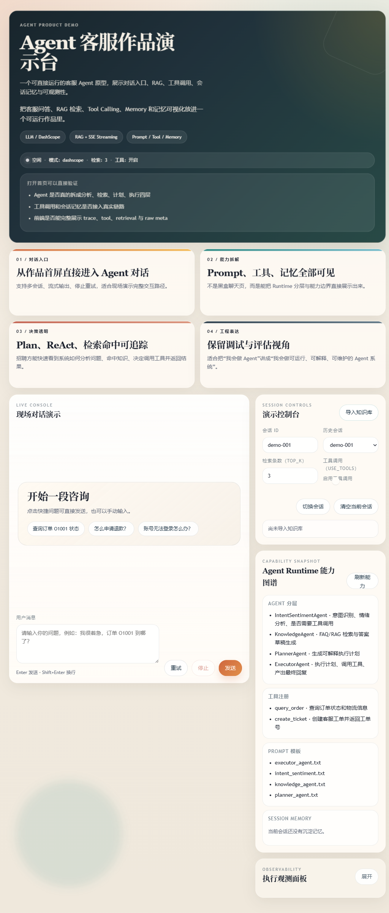
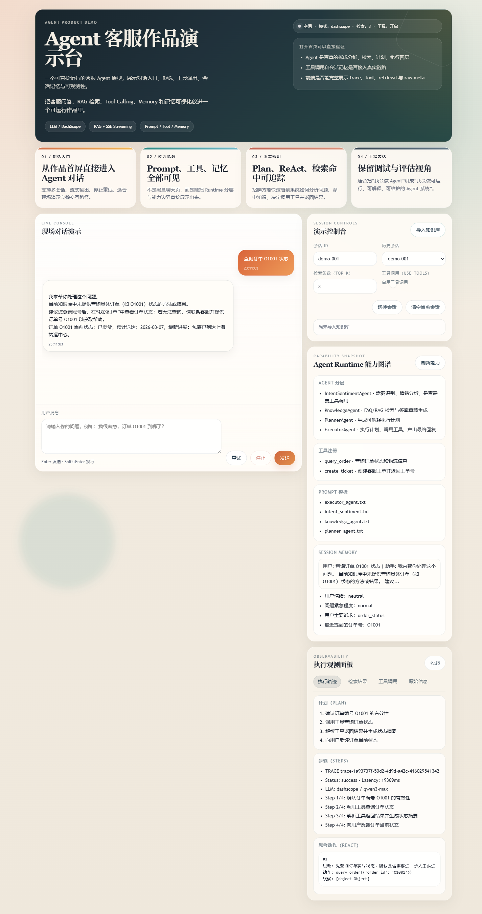

# Agent Customer Support Playground

一个面向客服场景的 Agent 工程化作品，用来展示我在 LLM 应用开发中的完整落地能力：对话入口、Prompt 管理、Tool Calling、RAG、简单 Memory、可扩展 Agent Runtime、SSE 流式交互，以及基础可观测性。

这个项目不是“只会聊天”的 Demo，而是一个可以直接运行、可调试、可扩展的 Agent 原型。当前版本聚焦在客服主链路：用户提问后，系统会进行意图与情绪分析，检索 FAQ，按需调用订单/工单工具，并把推理轨迹、工具结果、记忆状态一起返回给前端。

## 项目截图

### 首页展示



### 对话与调试链路



## 项目简介

- 场景定位：电商/客服场景下的智能问答与工单协同
- 项目目标：用最小可运行版本展示一个 Agent 应用从后端编排到前端交互的完整闭环
- 当前形态：FastAPI 后端 + 原生前端 + SSE 流式输出 + 本地知识库检索
- 适合展示的能力点：
  - LLM 接入与 Prompt 工程
  - Agent 编排与 Tool Calling
  - Memory 与多轮对话上下文处理
  - RAG 检索增强
  - 工程化调试、日志、Trace、Eval

## 核心功能

### 1. 对话入口

- `POST /agent/chat`：新的 Agent 对话入口，支持流式输出
- `POST /chat`：保留兼容入口
- 前端支持：
  - 多会话切换
  - 流式回复
  - 停止 / 重试
  - 调试信息展示

### 2. Prompt 模板管理

- 新增 `PromptManager`
- 自动扫描 `prompts/` 目录中的模板
- 当前已接管以下 Prompt：
  - `intent_sentiment.txt`
  - `knowledge_agent.txt`
  - `planner_agent.txt`
  - `executor_agent.txt`
- 支持通过 `/agent/capabilities` 查看当前 Prompt 列表

### 3. Tool Calling

- 新增 `ToolRegistry`，统一注册工具定义与执行函数
- 当前内置工具：
  - `query_order`：查询订单状态
  - `create_ticket`：创建客服工单
- 工具既支持规则式触发，也支持 LLM function calling

### 4. 简单 Memory

- 保留原有 session history
- 新增轻量级 memory snapshot：
  - 最近会话摘要 `summary`
  - 关键事实 `facts`
  - 例如最近订单号、最近工单号、用户诉求、情绪、紧急程度
- Memory 已接入执行链路，可在多轮对话中辅助补全订单号
- 可通过 `GET /agent/memory/{session_id}` 查看当前会话记忆

### 5. RAG 检索增强

- 支持 FAQ Markdown 导入
- 默认检索链路：
  - 有 embedding 能力时：Chroma + 向量检索
  - 无 embedding 能力时：TF-IDF fallback
- `POST /ingest` 可重新导入知识库

### 6. Trace、日志与错误处理

- 每轮对话生成 `trace_id`
- 将分析、检索、计划、执行、工具调用整合为结构化 trace
- 日志中按阶段记录：
  - `analysis`
  - `knowledge`
  - `plan`
  - `execute`
- 前端可查看：
  - Plan
  - ReAct 轨迹
  - 检索命中
  - 工具调用结果
  - 原始 JSON

## 技术架构

### 后端

- `FastAPI`：接口服务与 SSE 流式输出
- `OpenAI SDK`：兼容 OpenAI / DashScope 接口
- `ChromaDB`：向量知识库
- `scikit-learn`：TF-IDF fallback 检索

### 前端

- 原生 `HTML + CSS + JavaScript`
- `ReadableStream` 实现流式消息消费
- 多面板调试视图，适合展示 Agent 内部执行过程

### Agent Runtime 分层

当前运行时链路如下：

`用户输入 -> AgentRuntime -> IntentSentimentAgent -> KnowledgeAgent(RAG) -> PlannerAgent -> ExecutorAgent -> ToolRegistry -> SSE 输出前端`

对应职责：

- `IntentSentimentAgent`
  - 识别意图、情绪、紧急程度
  - 判断是否需要工具调用
- `KnowledgeAgent`
  - 检索 FAQ
  - 输出 answer draft
- `PlannerAgent`
  - 生成 3~6 步可解释计划
- `ExecutorAgent`
  - 决定工具策略
  - 调用工具
  - 产出最终回复
- `AgentRuntime`
  - 管理 trace、memory、日志、能力描述接口

## Agent 能力说明

### 已实现

#### 1. 多 Agent 串行编排

不是单 Prompt 直接回答，而是把分析、检索、计划、执行拆成独立角色，便于扩展和调试。

#### 2. Tool Calling 双通路

- 规则式调用：保障关键客服场景稳定可控
- LLM function calling：保留更自然的 Agent 执行方式

#### 3. 简单可用的会话记忆

当前 Memory 为内存版，不做持久化，但已经具备：

- 短期历史对话
- 关键事实沉淀
- 会话摘要
- 在执行阶段参与决策

#### 4. 可观测的 Agent 过程

前端可以看到这轮回答不是“黑盒生成”，而是包含：

- 为什么要这样规划
- 是否命中知识库
- 是否调用工具
- 工具返回了什么
- 最终怎么形成答复

## 使用方法

### 1. 安装依赖

```powershell
python -m venv .venv
.venv\Scripts\Activate.ps1
pip install -r requirements.txt
```

### 2. 配置环境变量

参考 [`.env.example`](./.env.example)。

如果使用 DashScope / Qwen，可配置：

```env
DASHSCOPE_API_KEY=your_key
DASHSCOPE_BASE_URL=https://dashscope.aliyuncs.com/compatible-mode/v1
DASHSCOPE_MODEL=qwen3-max
DASHSCOPE_EMBEDDING_MODEL=text-embedding-v4
```

如果使用 OpenAI 兼容接口，也支持：

```env
OPENAI_API_KEY=your_key
OPENAI_BASE_URL=https://your-base-url/v1
OPENAI_MODEL=gpt-4o-mini
EMBEDDING_MODEL=text-embedding-3-small
```

### 3. 启动服务

```powershell
.\.venv\Scripts\python -m uvicorn app.main:app --host 127.0.0.1 --port 8000
```

启动后可访问：

- [http://127.0.0.1:8000/](http://127.0.0.1:8000/)
- [http://127.0.0.1:8000/health](http://127.0.0.1:8000/health)
- [http://127.0.0.1:8000/agent/capabilities](http://127.0.0.1:8000/agent/capabilities)

### 4. 导入知识库

```bash
curl -X POST "http://127.0.0.1:8000/ingest" \
  -H "Content-Type: application/json" \
  -d "{\"file_path\":\"data/faq.md\"}"
```

### 5. 调用 Agent 对话接口

```bash
curl -N -X POST "http://127.0.0.1:8000/agent/chat" \
  -H "Content-Type: application/json" \
  -d "{\"session_id\":\"demo-001\",\"message\":\"我很着急，帮我查一下订单 O1001 到哪了\",\"show_debug\":true}"
```

### 6. 查看会话记忆

```bash
curl "http://127.0.0.1:8000/agent/memory/demo-001"
```

## 项目亮点

### 1. 不是概念图，而是可运行闭环

从前端对话入口，到后端编排、知识库检索、工具调用、日志、trace，当前仓库都能实际跑通。

### 2. 工程化表达比“模型能力堆砌”更完整

这个项目重点不是塞更多名词，而是把真正会被问到的工程问题补全：

- Prompt 怎么管理
- 工具如何注册与扩展
- 多轮记忆怎么接入决策
- 如何调试一次 Agent 回答
- 错误和 trace 怎么看

### 3. 保留了可验证材料

仓库内已有：

- `docs/`：范围说明与 trace 说明
- `eval/`：评测数据、脚本、结果
- `frontend/`：可直接演示的前端工作台

当前仓库保留了 40 条规则型评测样例与最近一次评测结果，可作为“功能稳定性验证材料”。

## 项目结构

```text
app/
  main.py               FastAPI 入口与 SSE 输出
  agent_runtime.py      Agent Runtime 编排
  agents.py             四类 Agent 角色实现
  prompt_manager.py     Prompt 模板管理
  tool_registry.py      工具注册与调度
  memory.py             会话历史 + facts + summary
  rag.py                Chroma / TF-IDF 检索
  llm.py                LLM 统一封装

frontend/
  index.html            Agent 工作台界面
  app.js                前端状态与请求逻辑
  ui.js                 UI 渲染层
  sse.js                流式消息消费

tools/
  order_api.py          订单查询工具（mock）
  ticket_api.py         工单创建工具（mock）

prompts/
  *.txt                 各 Agent Prompt 模板
```

## 后续优化方向

### 规划中

- 持久化 Memory
  - 当前仅为进程内 memory，重启后丢失
  - 后续可接 Redis / SQLite / 向量记忆

- 更通用的 Agent 插件机制
  - 当前已支持工具注册
  - 但还没有做到“Agent 动态装配 / 配置化工作流”

- 真实业务系统接入
  - 当前订单和工单工具是 mock
  - 后续可替换为真实 OMS / 工单系统 API

- 更完整的观测体系
  - 当前已有 trace 与阶段日志
  - 后续可接 Langfuse / OpenTelemetry / APM

- 更强的 RAG 能力
  - 当前以 FAQ 检索为主
  - 后续可加入 rerank、hybrid retrieval、多知识源路由

- 更严格的自动化评测
  - 当前以 rule-based eval 为主
  - 后续可补充 LLM-as-a-judge 与回归基准集

## 当前边界说明

- 订单查询、工单创建目前是 mock tool，适合演示 Agent 工作流，不代表已接真实生产系统
- Memory 已可运行，但属于轻量版，不包含跨进程持久化
- 多 Agent 是串行编排，不是通用多智能体协作平台
- 当前重点是“最小可运行 + 可展示 + 可解释”，不是生产级客服平台
