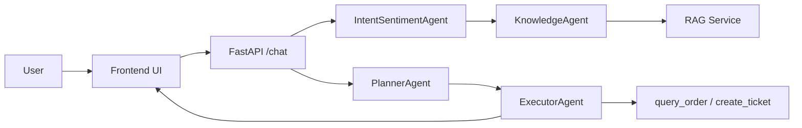

# AI Customer Support Agent

一个面向客服场景的智能体项目原型，重点展示 `RAG + Tool Calling + Plan-Execute + ReAct + Multi-Agent + SSE` 的组合能力。

这个仓库的目标不是做一个只会聊天的 Demo，而是做一个可运行、可观测、可评测、可讲述的 Agent 项目，用来支撑智能体开发相关面试和 GitHub 展示。

## 项目定位

- 面向订单、退款、登录、发票、地址修改等客服问题
- 支持真实模型接入，当前已接通 DashScope 兼容接口与 `qwen3-max`
- 支持知识库检索、工具调用、流式输出和调试面板
- 支持结构化 trace 和自动评测

V1 范围定义见：

- [`docs/v1-scope.md`](docs/v1-scope.md)

## 核心能力

- `RAG`
  - 支持 FAQ Markdown 导入
  - 支持向量检索
  - 在无真实 embedding 能力时支持 fallback
- `Tool Calling`
  - 当前内置 `query_order` 和 `create_ticket`
  - 工具结果会进入最终回答
  - 针对缺参数、越权请求、人工升级增加了规则守卫
- `Plan-Execute`
  - 先生成 plan，再执行
  - 前端调试面板可看到计划步骤
- `ReAct`
  - 展示 Thought / Action / Observation
  - 支持工具调用轨迹展示
- `Multi-Agent`
  - `IntentSentimentAgent`
  - `KnowledgeAgent`
  - `PlannerAgent`
  - `ExecutorAgent`
- `SSE`
  - 支持流式回复
  - 支持前端状态展示和调试信息
- `Trace`
  - `/chat` 会输出结构化 trace
  - 可用于 bad case 分析和自动评测

## 当前实现状态

截至 `2026-03-09`，项目已完成以下关键能力：

- 真实模型模式可运行，`/health` 返回 `llm_mode = dashscope`
- 前端主页可直接访问，根路径会跳转到 `/frontend/`
- 知识库导入、聊天主链路、SSE 流式输出可用
- 多轮上下文可用于订单追问和工单跟进类场景
- 评测链路已支持 40 条结构化测试集
- 浏览器自动化可完成真实页面回归

## 系统架构



主链路：

1. 用户从前端发起咨询
2. `IntentSentimentAgent` 分析 `intent / sentiment / urgency / need_tool`
3. `KnowledgeAgent` 执行检索，产出 `answer_draft`
4. `PlannerAgent` 生成 plan
5. `ExecutorAgent` 根据 plan、工具策略和上下文执行
6. 后端通过 SSE 将结果和调试信息流式返回前端

## 目录结构

```text
app/                后端主逻辑、Agent、RAG、配置、内存
frontend/           原生前端与 SSE 调试界面
tools/              订单查询与工单创建工具
prompts/            各 Agent 提示词
data/               FAQ 知识库
docs/               V1 范围、Trace、RAG 路线图
eval/               评测数据集、评测脚本、评测结果
```

## 快速开始

### 1. 安装依赖

```powershell
python -m venv .venv
.venv\Scripts\Activate.ps1
pip install -r requirements.txt
```

### 2. 配置 `.env`

参考 [`.env.example`](.env.example)。

如果使用 DashScope / Qwen：

```env
DASHSCOPE_API_KEY=your_key
DASHSCOPE_BASE_URL=https://dashscope.aliyuncs.com/compatible-mode/v1
DASHSCOPE_MODEL=qwen3-max
DASHSCOPE_EMBEDDING_MODEL=text-embedding-v4
```

### 3. 启动服务

```powershell
.\.venv\Scripts\python -m uvicorn app.main:app --host 127.0.0.1 --port 8000
```

访问：

- [http://127.0.0.1:8000/](http://127.0.0.1:8000/)
- [http://127.0.0.1:8000/health](http://127.0.0.1:8000/health)

### 4. 导入知识库

前端可以直接点击“导入知识库”，也可以手动调用：

```bash
curl -X POST "http://127.0.0.1:8000/ingest" \
  -H "Content-Type: application/json" \
  -d '{"file_path":"data/faq.md"}'
```

### 5. 测试聊天接口

```bash
curl -N -X POST "http://127.0.0.1:8000/chat" \
  -H "Content-Type: application/json" \
  -d '{"session_id":"demo-001","message":"我很着急，我的订单 O1001 到哪了？","show_debug":true}'
```

## 可观测性

当前 `/chat` trace 已覆盖：

- `trace_id`
- `timestamp`
- `llm.mode`
- `llm.model`
- `analysis`
- `retrieval.hits`
- `plan`
- `tool_calls`
- `final_answer`
- `latency_ms`
- `status`
- `error.type`

Trace 结构与错误分类见：

- [`docs/trace-schema.md`](docs/trace-schema.md)

## 评测体系

当前仓库已内置：

- 40 条结构化测试数据
- 自动评测脚本
- bad case 自动归因
- 多轮场景预热能力

相关文件：

- [`eval/customer_support_v1_eval_dataset.json`](eval/customer_support_v1_eval_dataset.json)
- [`eval/run_eval.py`](eval/run_eval.py)
- [`eval/README.md`](eval/README.md)

运行方式：

```powershell
.\.venv\Scripts\python eval\run_eval.py --output eval\results\full-run-latest.json
```

### 最新全量评测结果

评测时间：`2026-03-09`

报告文件：

- [`eval/results/full-run-latest.json`](eval/results/full-run-latest.json)

核心结果：

- `cases_total`: `40`
- `auto_pass_rate`: `1.0`
- `bad_case_count`: `0`
- `intent_accuracy`: `1.0`
- `sentiment_accuracy`: `1.0`
- `urgency_accuracy`: `1.0`
- `need_tool_accuracy`: `1.0`
- `tool_match_rate`: `1.0`
- `retrieval_topic_hit_rate`: `1.0`
- `literal_safety_rate`: `1.0`
- `request_success_rate`: `1.0`

当前这版自动评测报告里，`40/40` 样例全部自动通过。

## 浏览器自动化回归

已在 `2026-03-09` 使用 Playwright 对真实页面做回归，覆盖：

- 打开首页
- 导入知识库
- 发送订单查询消息
- 检查 SSE 输出
- 检查调试面板中的 `plan / steps / react trace`

回归截图：

- [`tmp_playwright_regression_20260309.png`](tmp_playwright_regression_20260309.png)

## 文档

- [`docs/v1-scope.md`](docs/v1-scope.md)
- [`docs/trace-schema.md`](docs/trace-schema.md)
- [`docs/rag-roadmap.md`](docs/rag-roadmap.md)

## 已知问题

- 前端顶部“模式”字段在导入知识库后会显示 `chroma_openai`，这更像是检索模式，不完全等同于真实 LLM 模式
- 工具层目前仍是 mock，尚未接真实业务系统
- RAG 路线图已整理，但 hybrid retrieval / rerank 还未真正落地

## 下一步建议

- 继续消化剩余 6 条 `intent_error`
- 把评测报告做成更适合 GitHub 展示的摘要表
- 落地第一版 RAG 升级，而不只是路线图
- 增加面试材料：
  - 3 分钟项目介绍
  - 10 分钟深挖讲稿
  - 高频追问问答

## 适合面试中强调的点

- 这不是简单的聊天机器人，而是一个具备 `RAG + Tool + Planner + Multi-Agent + Trace + Eval` 的 Agent 系统原型
- 项目已经具备“从能跑到能解释”的基础设施
- 系统不仅可演示，还能做评测、回放和 bad case 归因
