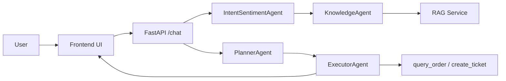

# AI Customer Support Agent

一个面向客服场景的可运行 Agent Demo / 原型，用来展示 `RAG`、`Tool Calling`、`Plan-Execute`、`ReAct`、`Multi-Agent`、`SSE` 和 `Trace / Eval` 在同一条业务链路中的组合方式。

这个仓库的重点不是做一个“功能尽可能多”的平台，而是做一个**能运行、能观察、能评测、能讲清边界**的智能体项目，适合作为 GitHub 公开展示和面试项目材料。

## Demo Highlights

- 真实模型已接通：当前支持 DashScope 兼容接口，已验证 `qwen3-max`
- 主链路可运行：支持 FAQ 导入、订单查询、工单创建、流式回复
- 有证据链：仓库内包含 `trace` 文档、评测数据、自动评测脚本和最新评测结果
- 有工程边界：当前版本明确区分“已跑通的原型能力”和“尚未做成生产级的平台能力”

## Quick Evidence

- V1 范围定义：
  - [`docs/v1-scope.md`](docs/v1-scope.md)
- Trace 结构与错误分类：
  - [`docs/trace-schema.md`](docs/trace-schema.md)
- 评测说明：
  - [`eval/README.md`](eval/README.md)
- 最新评测结果：
  - [`eval/results/full-run-latest.json`](eval/results/full-run-latest.json)
- 关键接口：
  - `GET /health`
  - `POST /ingest`
  - `POST /chat`

当前仓库内的最新自动评测报告显示：**40 条结构化规则评测样例全部通过**。  
这代表当前版本在这套已定义的评测规则下通过了验证，但**不等价于开放式回答质量已经最优，也不等价于生产环境泛化能力已经验证完成**。

## 系统架构

当前主链路是一个**串行编排的 Agent 原型**，核心流程可以直接按下面这条链理解：

`用户 -> Frontend UI -> /chat -> IntentSentimentAgent -> KnowledgeAgent / RAG -> PlannerAgent -> ExecutorAgent -> Tools -> SSE 返回前端`

为了方便 GitHub 页面阅读，即使不看图，也可以按上面的文字链路理解系统。

如果 GitHub 当前环境支持 Mermaid，下面这张图与文字描述是一致的：



## 当前版本已验证的内容

以下内容是当前仓库**已经实际跑通或已执行验证**的部分：

- 真实模型主链路可运行，`/health` 可返回 `llm_mode = dashscope`
- 根路径可跳转到 `/frontend/`，前端能发起真实聊天请求
- `/ingest`、`/chat`、SSE 流式返回和调试面板主链路可用
- 结构化 trace 已落地，能记录 `analysis / retrieval / plan / tool_calls / final_answer`
- 已执行一轮本地 Playwright 浏览器回归，覆盖首页、导入知识库、订单查询、隐私边界拒绝等核心路径
- 已执行一轮 40 条结构化样例的自动评测，并产出最新报告

这里的“已验证”指当前仓库版本已经完成本地运行和结果留存，不表示系统已经具备生产级 SLA、真实业务集成或开放域鲁棒性。

## 当前能力与边界

### Current Scope

当前版本重点验证的是：

- 客服问答场景下的一条完整 Agent 主链路
- 检索、工具、规划、执行、流式输出之间如何协同
- 如何用 `trace` 和 `eval` 给 Demo 增加可验证材料

当前版本暂不强调的是：

- 真实订单系统 / 工单系统集成
- 长期记忆、复杂权限、多租户
- 开放域问答能力
- 生产级稳定性、监控、治理和成本优化

### 能力与当前实现方式

| 能力 | 当前实现方式 | 当前边界 |
| --- | --- | --- |
| `RAG` | 基于 FAQ Markdown 导入、切分、Embedding + Chroma 检索；在缺少相关配置时支持 fallback | 当前主要是单知识源 FAQ 检索，还没有做多知识源路由、hybrid retrieval 或 rerank 落地 |
| `Tool Calling` | 当前内置 `query_order` 和 `create_ticket` 两个工具，工具结果会进入最终回答；对缺参数、越权请求和人工升级做了规则守卫 | 工具层仍是 mock，不代表已接真实业务系统 |
| `Multi-Agent` | 后端当前拆成分析、知识、规划、执行四类 Agent，按串行主链路编排 | 不是并行 agent runtime，也不是通用的多智能体协作平台 |
| `Plan-Execute` | 有独立 planner 和 executor，plan 会进入调试面板，也会影响后续执行 | 当前更接近轻量规划链路，不是长流程任务编排引擎 |
| `ReAct` | Executor 会输出 Thought / Action / Observation 轨迹，用于展示工具决策和执行过程 | 当前主要围绕单次请求内的工具轨迹，不是开放式长期循环 Agent |
| `SSE` | 前端通过 SSE 接收流式回答和调试信息 | 当前是 Demo 级流式交互，不是完整消息总线或断点恢复机制 |
| `Trace` | `/chat` 返回结构化 trace，可用于 bad case 排查和自动评测 | 当前 trace 更偏调试与评测支撑，不是完整 observability 平台 |
| `Evaluation` | 基于 40 条结构化样例执行规则评测，并输出 bad case 汇总 | 规则评测主要验证定义好的检查项，不等价于开放式回答质量已经“完美” |

## 目录结构

```text
app/                后端主逻辑、Agent、RAG、配置、内存
frontend/           原生前端与 SSE 调试界面
tools/              订单查询与工单创建工具
prompts/            各 Agent 提示词
data/               FAQ 知识库
docs/               V1 范围、Trace、RAG 路线图
eval/               评测数据集、评测脚本、评测结果
```

## 快速开始

### 1. 安装依赖

```powershell
python -m venv .venv
.venv\Scripts\Activate.ps1
pip install -r requirements.txt
```

### 2. 配置 `.env`

参考 [`.env.example`](.env.example)。

如果使用 DashScope / Qwen：

```env
DASHSCOPE_API_KEY=your_key
DASHSCOPE_BASE_URL=https://dashscope.aliyuncs.com/compatible-mode/v1
DASHSCOPE_MODEL=qwen3-max
DASHSCOPE_EMBEDDING_MODEL=text-embedding-v4
```

### 3. 启动服务

```powershell
.\.venv\Scripts\python -m uvicorn app.main:app --host 127.0.0.1 --port 8000
```

访问：

- [http://127.0.0.1:8000/](http://127.0.0.1:8000/)
- [http://127.0.0.1:8000/health](http://127.0.0.1:8000/health)

### 4. 导入知识库

前端可以直接点击“导入知识库”，也可以手动调用：

```bash
curl -X POST "http://127.0.0.1:8000/ingest" \
  -H "Content-Type: application/json" \
  -d '{"file_path":"data/faq.md"}'
```

### 5. 测试聊天接口

```bash
curl -N -X POST "http://127.0.0.1:8000/chat" \
  -H "Content-Type: application/json" \
  -d '{"session_id":"demo-001","message":"我很着急，我的订单 O1001 到哪了？","show_debug":true}'
```

## Evaluation

当前仓库的评测材料包括：

- [`eval/customer_support_v1_eval_dataset.json`](eval/customer_support_v1_eval_dataset.json)
- [`eval/run_eval.py`](eval/run_eval.py)
- [`eval/README.md`](eval/README.md)
- [`eval/results/full-run-latest.json`](eval/results/full-run-latest.json)

### 当前评测覆盖什么

当前这套评测主要覆盖：

- 订单、退款、登录、发票、地址修改、人工升级、越界请求和隐私安全场景
- `intent / sentiment / urgency`
- `need_tool`
- `tool_match`
- `retrieval_topic_hit`
- `literal_safety`
- `request_success`

### 如何解读当前结果

最新报告时间：`2026-03-09`

- `cases_total = 40`
- `auto_pass_rate = 1.0`
- `bad_case_count = 0`
- `manual_review_rate = 1.0`

这里最重要的边界说明是：

- `40/40` 指的是**当前这套结构化规则评测**全部通过
- 这说明系统在已定义的输入模式和检查规则下表现稳定
- 这**不等价于**开放式生成质量已经最优，也**不等价于**面对未见输入的泛化能力已经充分验证
- 报告中的 `manual_review_rate = 1.0` 也意味着：自然度、完整性、语气等更偏语义的维度，仍建议人工复核

## Roadmap

后续更适合继续做的是：

- 把评测结果整理成更适合 GitHub 展示的摘要页或对比表
- 落地第一版 RAG 升级，而不只停留在路线图
- 在保持当前边界清晰的前提下，逐步把 mock tools 替换成真实业务抽象
- 补充面试材料，例如 3 分钟项目介绍、10 分钟深挖讲稿和高频追问问答

RAG 路线图见：

- [`docs/rag-roadmap.md`](docs/rag-roadmap.md)

## 已知边界

- 前端顶部“模式”字段在导入知识库后会显示 `chroma_openai`，这更接近检索侧模式，不完全等同于当前 LLM 模式
- 工具层目前仍是 mock，适合展示 Agent 工作流，不代表已经接真实业务系统
- 当前版本重点是“可运行原型 + 可验证材料”，不是完整生产平台
